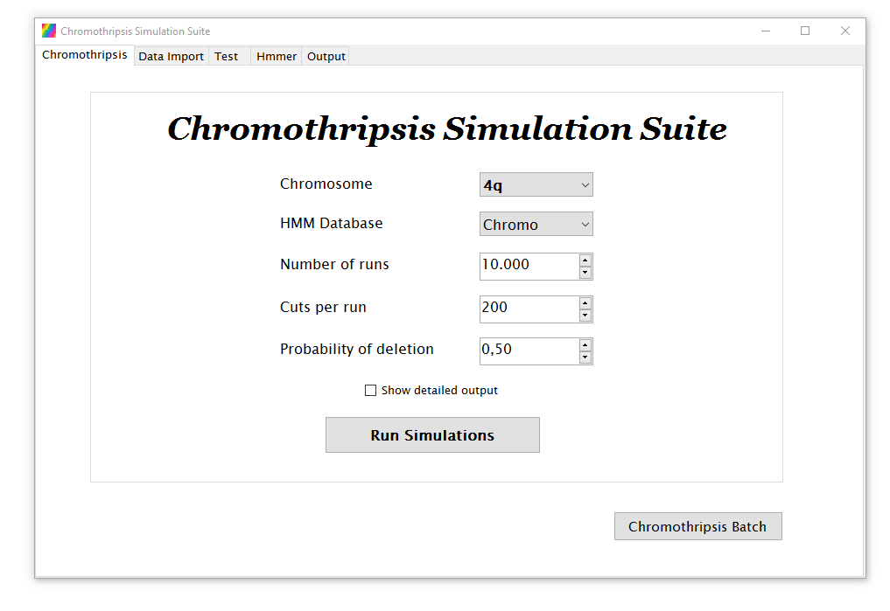

#  Chromothripsis Simulation Suite

 

 
C#, .NET 4.0, Visual Studio 2010, SQLite
 
 

## Download

Download prebuilt application (including test data): 
*Windows 7,8,10 - .NET* 
https://www.bernhardcaspar.de/files/chromothripsis-app.zip

 

## Bachelor Thesis
This project was created in the context of a bachelor thesis for the University of Applied Sciences for Engineering and Economics, Berlin
 
 
Download bachelor thesis (in German): 
*Simulation von Chromosomenbrüchen bei der Tumorentstehung, Konzept der Chromothripsis, Simulation am Beispiel des Chromosomenarms 4q durch einfache Deletion* 
https://www.bernhardcaspar.de/files/chromothripsis-thesis.zip